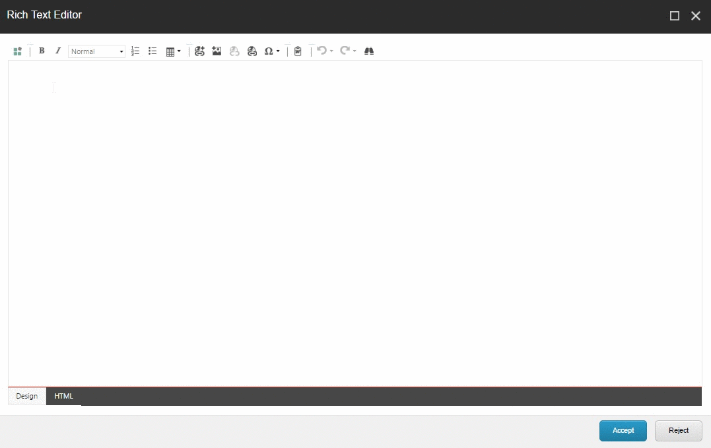
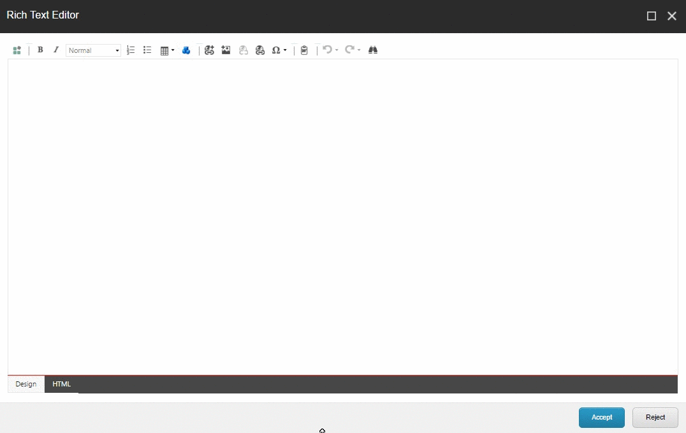
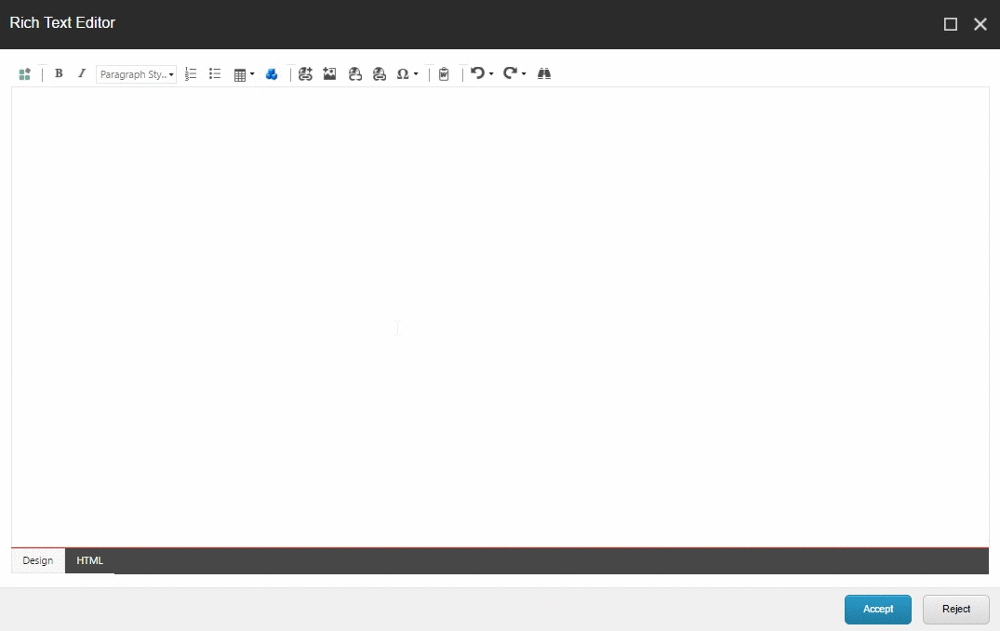
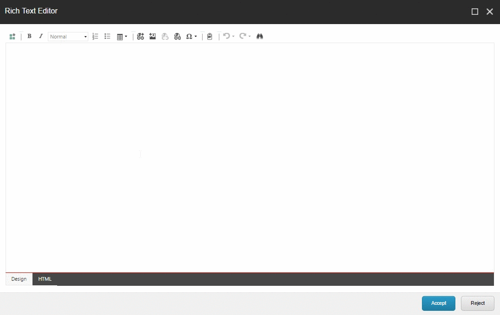

# Sitecore TokenManager
TokenManager is a framework designed to allow any type of content to be dynamically injected into a RTE field.
## Example Usages
+ User name injection:
	* If you have access to a users name information in your session, you can make that name available for injection into a paragraph allowing the content authors to create personalized pages in a natural language 
+ Captioned image:
	* If your images have attribution data that is needed to display, a token can take a sitecore image and a text line to generate the markup needed for an image with caption.
+ Google Map widget:
	* Collect an address from the author when the token is placed in an RTE and use that data to render a map centered on the address.
+ Video widget:
	* Collect a youtube video id from the author when the token is placed in an RTE to render an iframe embed.
+ Search Results:
	* Execute a search request and store the resulting information about number of results, pages, searched text, etc.. in a model on the session or HttpContext.  You can then expose this information in tokens to allow an author to use a natural language for search results.
+ Insert PDF link with size:
	* Collect PDF item from user at token insertion time and use that data to render a PDF link with the PDF size.
+ Authoring Accelerator:
	* Add a field to the page level item which can be exposed for component level items to inject.  This can be useful if your content is mostly copy and paste.  
	For example, say you have a healthcare website that has a section about conditions.  Each condition has the same set of 4 links each have the condition name in the text.
	You can create a token for the condition name and in the standard values of the 4 links insert the tokens.  At this point you can create a much more complete default state.
## Token Types	
### Automatically wired tokens
These tokens are designed primarilly for developers.  They're quick and easy to use, however are not configurable by authors.
+ AutoToken
	* General use token, will fit a wide variety of situations with the full array of extra data options.
+ ViewAutoToken
	* Same as the AutoToken except utilizes cshtml view.
## Installing TokenManager
The [Nuget package](https://www.nuget.org/packages/TokenManager/) is recommended to use for installation.
The package contains a config and a DLL.  The Sitecore items are installed by an initialize process that unpacks an embedded sitecore package that contains the templates.
This Sitecore package is then copied over to the data/packages folder, make sure that your IIS install has access to this folder. 
## Creating tokens
### AutoTokens
In any assembly loaded by the web container implement the abstract class AutoToken.
here is an example of the simplest form of token.
```cs
public class DemoAutoToken : AutoToken
{
	//Make sure you have a parameterless constructor.
	public DemoAutoToken() : base( collectionName: "Demo Collection", tokenIcon: "people/16x16/cubes_blue.png", tokenName:"Demo Token")
	{
	}

	/// <summary>
	/// Returns the value for the token that is then injected into the RTE.
	/// </summary>
	/// <param name="extraData">The user defined data that was gathered when the author added the token to the RTE.</param>
	/// <returns>Token Value</returns>
	public override string Value(TokenDataCollection extraData)
	{
		return "My Value";
	}
}
```
You may also define a model to specify the extra data and to help strongly type your token.  This method is recommended for code clarity and maintenance.
```cs
public class DemoAutoToken2 : AutoToken<DemoAutoToken2Model>
{
	//Make sure you have a parameterless constructor.
	public DemoAutoToken2() : base(collectionName: "Demo Collection 2", tokenIcon: "people/16x16/cubes_blue.png", tokenName:"Demo Token")
	{
	}
	/// <summary>
	/// Render the token value given your requested model.
	/// </summary>
	/// <param name="model">The model you are to use to build the token value.</param>
	/// <returns>Token Value</returns>
	public override string Render(DemoAutoToken2Model model)
	{
		return model.MySecretValue;
	}
}
```
With this being our decorated model.
```cs
	public class DemoAutoToken2Model
	{
		//Indicates the user should be prompted to enter a string value when inserting this token.
		[TokenString(label: "Give us a string", placeholder: "Enter string here", required: true)]
		public string MySecretValue { get; set; }
	}
```
### ViewAutoTokens
This type is very similar to the AutoToken however it utilizes a cshtml view and model to render.
```cs
public class DemoViewToken : ViewAutoToken<DemoAutoToken2Model>
{
	//Make sure you have a parameterless constructor.
	public DemoViewToken() : base(collectionName: "Demo View Collection", tokenIcon: "people/16x16/cubes_blue.png", tokenName: "Demo View Token")
	{
	}
	/// <summary>
	/// Given the populated model, return the full cshtml path from the webroot.
	/// </summary>
	/// <param name="model">The populated model</param>
	/// <returns>full path to the cshtml file.</returns>
	public override string GetViewPath(DemoAutoToken2Model model)
	{
		return "/views/DemoViewToken.cshtml";
	}
}
```
Note that this is using the same model from the AutoToken example above.
This is the cshtml file at /views/DemoViewToken.cshtml
```cshtml
@model TokenManager.DemoAutoToken2Model
<div><strong>@Model.MySecretValue</strong></div>
```
## Token Selection
After you have defined your tokens they will appear in the TokenManager dialog that is available in the RTE.

### Optional token button
AutoTokens and ViewAutoTokens can have an RTE button automatically applied to inject that particular token without the dialog.
```cs
	/// <summary>
	/// Assign an RTE button for this token.
	/// </summary>
	/// <returns>TokenButton object used to render the button for this token.</returns>
	public override TokenButton TokenButton()
	{
		return new TokenButton(name: "Insert a demo snippet", icon: "people/16x16/cubes_blue.png", sortOrder: 250);
	}
```

### Limiting token scope
There are a few ways to limit what tokens are available in particular RTE contexts.
+ Override IsCurrentContextValid
+ Override ValidParents
+ Override ValidTemplates
```cs		
	public override bool IsCurrentContextValid(Item item = null)
	{
		// Only available on items that's name start with bob;
		return item?.Name.StartsWith("bob") ?? false;
	}

	public override IEnumerable<ID> ValidParents()
	{
		// only available if in a subtree rooted at these items
		yield return new ID("11111111-1111-1111-1111-111111111111");
	}

	public override IEnumerable<ID> ValidTemplates()
	{
		// only available on items with this template
		yield return new ID("11111111-1111-1111-1111-111111111111");
	}
```
### Optional token appearance
You have a limited amount of control as to what the token looks like in the RTE.  This is limited by the way the RTE works and how browsers re-arrange invalid markup.
For example if you try to use a div tag inside a p tag chrome will automatically re-arrange it.  Normally this probably wouldn't cause horrible things to happen, however the modifications that chrome makes will end up being saved and very likely corrupt the token.
However if you stick to things that are symantically correct to go in a p tag you'll be fine.  Additionally, in the example below it's outputting some text entered by the authors, This is dangerous too as content authors could attempt to write html and likewise break the token.
A good rule of thumb is to not use this feature unless there is a really great reason to.
```cs
	/// <summary>
	/// Modifies the default way the token is displayed in the RTE
	/// </summary>
	/// <param name="model">The tokens model</param>
	/// <returns>Markup for the token for the RTE</returns>
	public override string TokenIdentifierText(DemoAutoToken2Model model)
	{
		return $"<span style='color:red;font-size:large'>hey</span><span>now</span>{model.MySecretValue}";
	}
```

## Token Parameters
There are a number of data types that are available for application to tokens.  These end up prompting the user to enter a particular value when inserted into an RTE.
+ StringTokenData
	* Request a string from the author.
+ IntegerTokenData
	* Request a number from the author.
+ BooleanTokenData
	* Request true or false from the author.
+ IdTokenData
	* Request a Sitecore id from the author, given a subtree root.
+ DroplistTokenData
	* Request one of several options from the author.
+ GeneralLinkTokenData
	* Request a Sitecore style general link information from the author.
##### These Token Data types are applied to a model using attributes.
```cs
	[TokenString(label: "Give us a string",placeholder: "Enter string here", required: true)]
	public string MyString;

	[TokenInteger(label: "Give us an int", required: true)]
	public int MyInt;

	[TokenBoolean(label: "Give us a boolean")]
	public bool MyBoolean;

	[TokenId(label: "Give us an item", required: true)]
	public ID MyItem;

	[TokenDroplist(label: "Give us an option", required: true, options: new[] { "op1", "Option 1", "op2", "Option 2" })]
	public string MyDroplist;

	// Options will be the children of the item at the id given.  The value will be the item name, or the item id depending on the valueAsId boolean.
	[TokenDroplist(label: "Give us an option based on the sitecore items at this root", required: true, id:"{62BC5816-165B-413D-B8E7-692063D12374}", valueAsId:false)]
	public string MyDroplist2;

	[TokenGeneralLink(label: "Give us a link", required: true, root:"{110D559F-DEA5-42EA-9C1C-8A5DF7E70EF9}")]
	public string MyLink;
```
If not using a model based token, which you should, these are available as an override on the AutoToken class.
```cs
	/// <summary>
	/// Defines what extra data to collect from the user when the token was inserted into the RTE.
	/// </summary>
	/// <returns>List of token data types to collect from the user when the token was inserted into the RTE.</returns>
	public override IEnumerable<ITokenData> ExtraData()
	{
		yield return new StringTokenData(label: "Give us a string", name:"mystring",  placeholder: "Enter string here", required: true);
		yield return new IntegerTokenData(label: "Give us an integer", name:"myint", required:true);
		yield return new BooleanTokenData(label: "Give us a boolean", name:"mybool");
		yield return new IdTokenData(label: "Give us a sitecore Item", name: "myitem", required:true, root: "{51C9E0EB-C6C8-45B0-A646-7B6E78C286B6}");
		yield return new DroplistTokenData(label: "Give us an option", name: "myoption", required:true, options: new []
		{
			new KeyValuePair<string, string>("Option 1", "op1"), 
			new KeyValuePair<string, string>("Option 2", "op2")
		});
		yield return new GeneralLinkTokenData(label: "Give us a link", name: "mylink", root: "{51C9E0EB-C6C8-45B0-A646-7B6E78C286B6}", required: true);
	}
```

### Customize your model
By overriding the rendering method you can customize your model to pass to your view.  This would be useful if some of the data for the token didn't come from content author input.
```cs
	public override string Render(DemoAutoToken2Model model)
	{
		model.UserName = Sitecore.Context.User.Name;
		return base.Render(model);
	}
```
### Legacy Sitecore wired tokens
These tokens are designed primarily for authors.  They take more development effort to set up, but allows the authors to maintain their own tokens.
In practice these tokens have not proven to be particularly useful, but they still exist for now.  You can read more about them [here](https://jeffdarchuk.com/2015/10/26/sitecore-tokenmanager/)
+ Basic Token
	* A simple token that injects content from an RTE.
+ Rendering Token
	* A token that is configured with a particular rendering which the author is prompted to specify a datasource item on insertion.
+ Rules Token
	* A token that  has its value resolved based on the rules engine.
+ Shared Link Token
	* A token that resolves to a link, useful if you have a link used in many places that changes often.